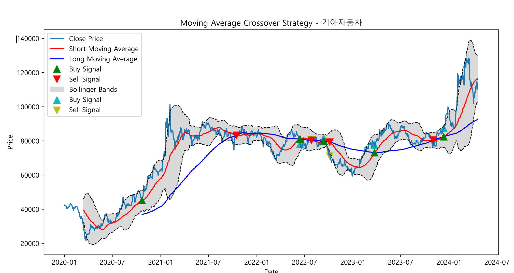

# Stock Analysis

This repository contains scripts for analyzing stock data using Python.

## Overview

1. 볼륨 가중 이동 평균(VWMA) 전략
- calculate_vwma 메서드: 주어진 기간 동안의 가격과 거래량을 사용하여 VWMA를 계산합니다.
- vwma_strategy 메서드: VWMA와 동일 기간의 단순 이동 평균(SMA)을 비교하여 매수/매도 신호를 생성합니다. VWMA가 SMA를 상향 돌파하면 매수, 하향 돌파하면 매도 신호로 간주합니다.
- plot_vwma_strategy 메서드: VWMA 전략의 결과를 시각화하여 PDF에 저장합니다.
2. 일목균형표(Ichimoku Cloud) 전략
- calculate_ichimoku_cloud 메서드: 일목균형표의 구성 요소(전환선, 기준선, 선행스팬 A와 B, 후행스팬)를 계산합니다.
- ichimoku_strategy 메서드: 전환선과 기준선의 교차, 그리고 가격이 구름대 위에 위치하는지를 확인하여 매수/매도 신호를 생성합니다.
- plot_ichimoku_strategy 메서드: 일목균형표 전략의 결과를 시각화하여 PDF에 저장합니다.
3. 평균 방향성 지수(ADX) 전략
- calculate_adx 메서드: ADX, +DI, -DI 지표를 계산합니다.
- adx_strategy 메서드: +DI와 -DI의 관계 및 ADX 값이 특정 임계값(예: 25)을 초과하는지를 확인하여 매수/매도 신호를 생성합니다.

## Results

The analysis results are summarized in the following PDF file:

## Usage

To use the scripts, follow these steps:

1. Clone this repository to your local machine.
2. Install the required dependencies by running `pip install -r requirements.txt`.
3. Run the main script `main.py` to perform the analysis.

## Examples

Here are some examples of the analysis results:

- [Example 1: Apple Inc.](examples/apple_analysis.md)
- [Example 2: Samsung Electronics](examples/samsung_analysis.md)

## License

This project is licensed under the MIT License - see the [LICENSE](LICENSE) file for details.

## Update

python -m build dist/stock_lab-0.0.1-py3-none-any.whl: